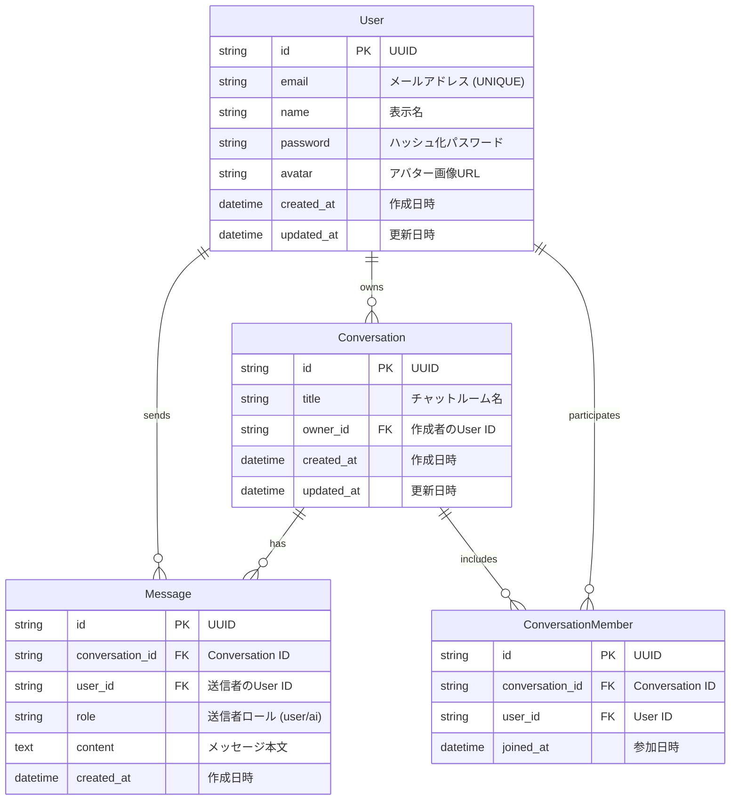

# データベース設計

Antigravity Chatのデータベース設計書です。

## ER図

## テーブル定義

### 1. User (ユーザー)

アプリケーションのユーザー情報を管理するテーブルです。

| カラム名 | データ型 | 制約 | 説明 |
| :--- | :--- | :--- | :--- |
| `id` | String (UUID) | PK, Default: uuid | 一意の識別子 |
| `email` | String | UNIQUE, NOT NULL | メールアドレス（ログインID） |
| `name` | String | NOT NULL | 表示名 |
| `password` | String | NOT NULL | bcryptでハッシュ化されたパスワード |
| `avatar` | String | NULLABLE | アバター画像のURL |
| `created_at` | DateTime | Default: now() | アカウント作成日時 |
| `updated_at` | DateTime | Default: now() | 最終更新日時 |

### 2. Conversation (チャットルーム)

チャットのセッションやルームを管理するテーブルです。

| カラム名 | データ型 | 制約 | 説明 |
| :--- | :--- | :--- | :--- |
| `id` | String (UUID) | PK, Default: uuid | 一意の識別子 |
| `title` | String | NOT NULL | チャットのタイトル（例: "General", "Project Alpha"） |
| `owner_id` | String (UUID) | FK, Index | チャットルームの作成者 |
| `created_at` | DateTime | Default: now() | 作成日時 |
| `updated_at` | DateTime | Default: now() | 最終更新日時 |

### 3. Message (メッセージ)

各チャット内の個別のメッセージを保存するテーブルです。

| カラム名 | データ型 | 制約 | 説明 |
| :--- | :--- | :--- | :--- |
| `id` | String (UUID) | PK, Default: uuid | 一意の識別子 |
| `conversation_id` | String (UUID) | FK, Index | 紐づくConversationのID |
| `user_id` | String (UUID) | FK, Index | メッセージ送信者のUser ID |
| `role` | String | NOT NULL | メッセージの送信者 (`user` または `ai`) |
| `content` | Text | NOT NULL | メッセージの本文 |
| `created_at` | DateTime | Default: now() | 送信日時 |

### 4. ConversationMember (チャットルームメンバー)

ユーザーとチャットルームの多対多の関係を管理する中間テーブルです。

| カラム名 | データ型 | 制約 | 説明 |
| :--- | :--- | :--- | :--- |
| `id` | String (UUID) | PK, Default: uuid | 一意の識別子 |
| `conversation_id` | String (UUID) | FK, Index | Conversation ID |
| `user_id` | String (UUID) | FK, Index | User ID |
| `joined_at` | DateTime | Default: now() | チャットルームへの参加日時 |

**Unique制約**: `(conversation_id, user_id)` の組み合わせは一意

## 備考

- **ID**: UUIDを使用して、将来的なスケーラビリティと衝突回避を考慮します。
- **Role**: 現状は `user` と `ai` のみを想定していますが、将来的に `system` などを追加可能です。
- **Index**: 
  - `conversation_id` と `user_id` にインデックスを張り、検索を高速化します。
  - `email` はUNIQUE制約により自動的にインデックスが作成されます。
- **セキュリティ**: パスワードは必ずbcryptでハッシュ化してから保存します。
